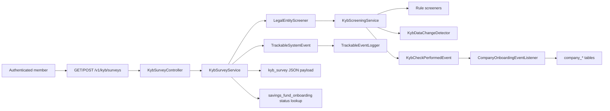

# Backend onboarding slice

This document is a fast path into the backend architecture and coding style of `onboarding-service`.

It does two things:

1. captures the repository-level decisions that shape most changes here
2. explains one minimal but non-trivial slice end to end: **legal-entity KYB -> company onboarding -> savings-fund onboarding status**

The chosen slice is intentionally small enough to read in one sitting, but rich enough to show real business rules, validation, authentication, authorization, audit logging, persistence, events, and testing.

## Why this slice

This slice is a better onboarding example than plain CRUD because it combines:

- authenticated API access
- controller-level request validation
- business-rule screening through multiple rule components
- client-safe error mapping
- event-driven writes across modules
- audit/system-event logging
- relational persistence plus JSON payload persistence
- idempotent status handling

Core files:

- `src/main/java/ee/tuleva/onboarding/kyb/survey/KybSurveyController.java`
- `src/main/java/ee/tuleva/onboarding/kyb/survey/KybSurveyService.java`
- `src/main/java/ee/tuleva/onboarding/kyb/LegalEntityScreener.java`
- `src/main/java/ee/tuleva/onboarding/kyb/KybScreeningService.java`
- `src/main/java/ee/tuleva/onboarding/kyb/KybDataChangeDetector.java`
- `src/main/java/ee/tuleva/onboarding/company/CompanyOnboardingEventListener.java`
- `src/main/java/ee/tuleva/onboarding/savings/fund/SavingsFundOnboardingRepository.java`
- `src/main/java/ee/tuleva/onboarding/savings/fund/LegalEntitySavingsFundOnboardingService.java`
- `src/main/java/ee/tuleva/onboarding/event/TrackableEventLogger.java`
- `src/main/java/ee/tuleva/onboarding/config/SecurityConfiguration.java`

## Repository-level architecture decisions

### 1. Modular monolith with explicit boundaries

The application is a Spring Boot modular monolith with Spring Modulith.

- top-level packages under `ee.tuleva.onboarding` act as modules
- package-root types are the public API
- sub-packages are internal implementation details
- cross-module coordination prefers Spring application events over direct internal-type coupling

References:

- `README.md`
- `src/main/java/ee/tuleva/onboarding/package-info.java`
- `src/main/java/ee/tuleva/onboarding/kyb/package-info.java`
- `src/test/groovy/ee/tuleva/onboarding/investment/transaction/TransactionModuleBoundaryTest.java`

### 2. Thin controllers, business logic in services/components

Controllers are routing and security-adapter layers. Decision-heavy logic lives in services and focused collaborators such as `*Screener`, `*Mapper`, `*Validator`, `*Listener`, and `*Job`.

Examples:

- `kyb/survey/KybSurveyController.java`
- `kyb/survey/KybSurveyService.java`
- `kyb/LegalEntityScreener.java`
- `kyb/screener/CompanyAgeScreener.java`

### 3. Anti-corruption around external integrations

External SOAP/JSON models are not the domain model. Integration modules map transport types into domain records before the rest of the application sees them.

Examples:

- `ariregister/AriregisterClient.java`
- `kyb/KybCompanyDataMapper.java`
- `auth/jwt/JwtTokenUtil.java`

### 4. Prefer explicit domain results over framework-shaped leakage

This codebase prefers domain enums, records, and explicit DTOs over exposing persistence or transport implementation details.

Examples:

- `kyb/KybCheck.java`
- `kyb/KybCheckType.java`
- `kyb/survey/LegalEntityData.java`
- `kyb/survey/ValidatedField.java`

## End-to-end slice

### Request flow

#### 1. Security gates the endpoint

`SecurityConfiguration` defines coarse-grained URL authorization. `/v1/**` requires a `USER` authority by default, while controllers access the authenticated domain principal through `@AuthenticationPrincipal`.

References:

- `src/main/java/ee/tuleva/onboarding/config/SecurityConfiguration.java`
- `src/main/java/ee/tuleva/onboarding/auth/jwt/JwtAuthorizationFilter.java`

#### 2. The controller stays thin

`KybSurveyController` does only four things:

- receives HTTP input
- binds the authenticated principal
- applies bean validation with `@Valid`
- translates a small set of slice-specific exceptions into HTTP responses

References:

- `src/main/java/ee/tuleva/onboarding/kyb/survey/KybSurveyController.java`

#### 3. The service orchestrates the business flow

`KybSurveyService` is the center of the slice. It:

- verifies that the caller is a board member
- stores the submitted survey payload
- blocks already-onboarded companies
- runs the screening flow
- converts failed checks into client-facing field errors
- emits audit/system events for blocked and failed flows

This is not CRUD. The main value is the decision chain around whether onboarding may proceed.

Reference:

- `src/main/java/ee/tuleva/onboarding/kyb/survey/KybSurveyService.java`

#### 4. Screening is decomposed into focused rule components

`LegalEntityScreener` fetches company details and active relationships, maps them into domain input, and delegates to `KybScreeningService`.

`KybScreeningService` runs all `KybScreener` implementations, then appends a synthetic `DATA_CHANGED` result from `KybDataChangeDetector`, and publishes `KybCheckPerformedEvent`.

References:

- `src/main/java/ee/tuleva/onboarding/kyb/LegalEntityScreener.java`
- `src/main/java/ee/tuleva/onboarding/kyb/KybScreeningService.java`
- `src/main/java/ee/tuleva/onboarding/kyb/KybDataChangeDetector.java`
- `src/main/java/ee/tuleva/onboarding/kyb/screener/CompanyAgeScreener.java`

#### 5. Events cross module boundaries

`CompanyOnboardingEventListener` listens to `KybCheckPerformedEvent`. If onboarding-gate checks passed, it upserts company data and replaces related parties and representation rights.

This is the clearest example of the repository preference for event-driven module integration.

Reference:

- `src/main/java/ee/tuleva/onboarding/company/CompanyOnboardingEventListener.java`

#### 6. Onboarding status is queried through a small public repository API

The savings-fund module exposes a small, simple API around onboarding status. `SavingsFundOnboardingRepository` uses `JdbcClient` and includes an advisory-lock-based save path to keep status writes idempotent and safe.

References:

- `src/main/java/ee/tuleva/onboarding/savings/fund/SavingsFundOnboardingRepository.java`
- `src/main/java/ee/tuleva/onboarding/savings/fund/LegalEntitySavingsFundOnboardingService.java`
- `src/main/java/ee/tuleva/onboarding/savings/fund/SavingsFundOnboardingService.java`

## What this slice teaches about Spring usage here

### Security and authentication

- `SecurityFilterChain` is configured in code, not XML
- JWT auth is implemented with a custom `OncePerRequestFilter`
- controllers receive a domain principal via `@AuthenticationPrincipal AuthenticatedPerson`
- URL-level authorization is coarse; business checks still happen in services

References:

- `src/main/java/ee/tuleva/onboarding/config/SecurityConfiguration.java`
- `src/main/java/ee/tuleva/onboarding/auth/jwt/JwtAuthorizationFilter.java`
- `src/main/java/ee/tuleva/onboarding/auth/AuthController.java`

### Validation

Validation is layered:

1. bean validation for request shape
2. domain screening for business rules
3. client-safe error projection for UI consumption

Notable patterns:

- `@Valid @RequestBody` for transport validation
- sealed-interface JSON payloads to model structured questionnaires
- `ValidatedField<T>` to return both a value and field-specific errors
- internal `KybCheckType` values are not sent to clients directly

References:

- `src/main/java/ee/tuleva/onboarding/kyb/survey/KybSurveyResponse.java`
- `src/main/java/ee/tuleva/onboarding/kyb/survey/KybSurveyResponseItem.java`
- `src/main/java/ee/tuleva/onboarding/kyb/survey/KybSurveyService.java`

### Events, audit, and logging

The codebase uses Spring events for both domain reactions and auditing.

- `ApplicationEventPublisher` is the standard dispatch mechanism
- `@EventListener` handlers often live in the consuming module
- audit events are wrapped as `TrackableEvent` or `TrackableSystemEvent`
- `TrackableEventLogger` persists them

References:

- `src/main/java/ee/tuleva/onboarding/event/annotation/TrackableAspect.java`
- `src/main/java/ee/tuleva/onboarding/event/TrackableEvent.java`
- `src/main/java/ee/tuleva/onboarding/event/TrackableSystemEvent.java`
- `src/main/java/ee/tuleva/onboarding/event/TrackableEventLogger.java`
- `src/main/java/ee/tuleva/onboarding/event/broadcasting/AuditEventBroadcaster.java`

### Persistence patterns

This repo uses both JPA and Spring JDBC where each is the better fit.

- JPA entities for rich persistence models and JSON columns
- `JdbcClient` for concise read/write access where a repository method is simpler than a full entity model
- JSON persistence via `@JdbcTypeCode(JSON)`

Examples:

- `src/main/java/ee/tuleva/onboarding/kyb/survey/KybSurvey.java`
- `src/main/java/ee/tuleva/onboarding/savings/fund/SavingsFundOnboardingRepository.java`

### Time and scheduling

- time comes from injected `Clock`, never direct `now()`
- scheduled jobs use ShedLock for cluster-safe execution

Examples:

- `src/main/java/ee/tuleva/onboarding/time/ClockConfig.java`
- `src/main/java/ee/tuleva/onboarding/config/SchedulerLockConfiguration.java`

### Modern Spring APIs

Repository-wide preferences visible in code:

- `RestClient` over `RestTemplate`
- `RetryTemplate` with `RetryPolicy.builder()` over legacy retry libraries
- `JdbcClient` over older JDBC helpers

Examples:

- `src/main/java/ee/tuleva/onboarding/banking/seb/SebGatewayConfiguration.java`
- `src/main/java/ee/tuleva/onboarding/aml/risklevel/AmlRiskReader.java`

## Coding style and naming conventions

### Naming

Names are intentionally literal:

- `*Controller` for HTTP adapters
- `*Service` for orchestration
- `*Repository` for persistence boundaries
- `*Screener` for business rules
- `*Mapper` for translation
- `*Listener` for event consumers
- `*Job` for scheduled processes
- `*Configuration` for Spring wiring

Enums and event types are business names, not technical names:

- `KybCheckType.COMPANY_ACTIVE`
- `TrackableEventType.SAVINGS_FUND_ONBOARDING_STATUS_CHANGE`

### Syntactic sugar used deliberately

The codebase leans on modern Java syntax:

- records for immutable value types
- sealed interfaces for polymorphic request payloads
- switch expressions for business mapping
- `List.of` and `Map.of` for small immutable collections
- streams and collectors over manual loops when they clarify intent

Examples:

- `src/main/java/ee/tuleva/onboarding/kyb/KybCheck.java`
- `src/main/java/ee/tuleva/onboarding/kyb/survey/KybSurveyResponseItem.java`
- `src/main/java/ee/tuleva/onboarding/kyb/survey/KybSurveyService.java`

### Lombok usage

Lombok is used, but mostly for focused boilerplate reduction:

- `@RequiredArgsConstructor` for constructor injection
- `@Slf4j` for logging
- `@Builder` for aggregates and test fixtures
- `@Getter` on mutable/JPA/event classes

The stronger preference for immutable transport/domain values is plain Java records, not Lombok-heavy DTOs. Some older mutable DTOs still use broader Lombok annotations, but new slice code trends toward records plus narrow Lombok usage.

Examples:

- `src/main/java/ee/tuleva/onboarding/kyb/LegalEntityScreener.java`
- `src/main/java/ee/tuleva/onboarding/kyb/survey/KybSurvey.java`
- `src/main/java/ee/tuleva/onboarding/kyb/KybCheckPerformedEvent.java`

### Null-safety

Null-safety is explicit.

- packages opt into `@NullMarked`
- genuinely nullable fields are annotated instead of hidden behind sentinel values
- missing required data should fail fast

References:

- `src/main/java/ee/tuleva/onboarding/package-info.java`
- `src/main/java/ee/tuleva/onboarding/kyb/package-info.java`

### Logging

Logs prefer greppable key-value style:

- `"Description: field1=value1, field2=value2"`

Examples in this slice:

- board-member and validation flow logs in `KybSurveyService.java`
- integration logs in `AriregisterClient.java`
- audit persistence logs in `TrackableEventLogger.java`

## Testing style shown by this slice

This slice demonstrates the preferred test mix:

- `@WebMvcTest` for controller behavior
- `@DataJpaTest` for repository and persistence reactions
- `@SpringBootTest` only for true integration of multiple collaborators

Good entry points:

- `src/test/groovy/ee/tuleva/onboarding/kyb/survey/KybSurveyControllerTest.java`
- `src/test/groovy/ee/tuleva/onboarding/company/CompanyOnboardingEventListenerIntegrationTest.java`
- `src/test/groovy/ee/tuleva/onboarding/kyb/KybScreeningIntegrationTest.java`
- `src/test/groovy/ee/tuleva/onboarding/kyb/KybEndToEndTest.java`

What these tests show:

- authenticated controller tests with `@WithMockUser`, `authentication(...)`, and `csrf()`
- repository-focused integration tests without loading the whole application when not needed
- end-to-end business-rule assertions around screening outcomes and persisted audit/check history

## Recommended reading order for a new engineer

1. `README.md`
2. `config/SecurityConfiguration.java`
3. `kyb/survey/KybSurveyController.java`
4. `kyb/survey/KybSurveyService.java`
5. `kyb/LegalEntityScreener.java`
6. `kyb/KybScreeningService.java`
7. `company/CompanyOnboardingEventListener.java`
8. `savings/fund/SavingsFundOnboardingRepository.java`
9. the four tests listed above
10. `banking/seb/SebGatewayConfiguration.java` and `config/SchedulerLockConfiguration.java` for broader Spring patterns used elsewhere

## What to copy when adding new backend functionality

- keep controllers thin
- inject `Clock`
- prefer records for immutable domain/DTO values
- expose public module APIs from package roots, keep sub-packages internal
- use bean validation for transport shape and dedicated collaborators for business rules
- emit events when work crosses module boundaries
- prefer `JdbcClient`, `RestClient`, and modern Spring APIs
- write slice tests first, then repository/integration tests only where they buy confidence

## What this slice does not try to teach

This is not the entire backend. It is the smallest coherent path that still shows the project's real architectural style. After understanding it, the investment and banking modules will feel much more familiar rather than completely different.
